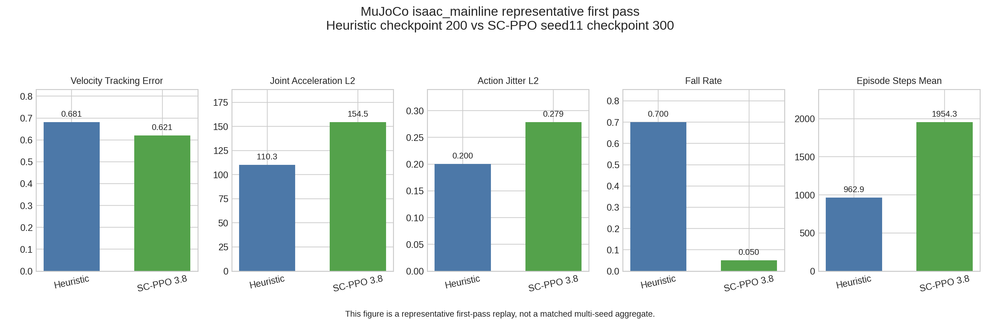

# Report-Grade Results for Smooth-Constrained PPO on Rough-Terrain Humanoid Locomotion

## Abstract

This report records the current report-grade result for the repo's smooth-control study. On the
Isaac rough-terrain main experiment, repaired PID-Lagrangian `SC-PPO` with `threshold = 3.8`
beats the selected heuristic smoothing baseline under a `3-seed + checkpoint-sweep` protocol. On
`MuJoCo isaac_mainline`, the current comparable replay supports only a bounded `partial transfer`
reading: `SC-PPO` is stronger on task stability and velocity tracking, but not yet on the current
behavior-level smoothness metrics. A tighter `3.6 + full_batch` challenger does not replace the
`3.8` mainline because its formal promotion attempt fails at the Isaac stage.

## 1. Research Question and Current Claim

This project is a research-validation delivery rather than a framework productization effort. The
current question is whether repaired PID-Lagrangian `SC-PPO` can beat a strong heuristic
smoothness baseline on the repo's rough-terrain humanoid velocity-tracking task.

The current report-grade claim is narrow and explicit:

1. On the Isaac rough-terrain main experiment, repaired PID-Lagrangian `SC-PPO` with
   `threshold = 3.8` now supports a real `method beats heuristic` result.
2. On `MuJoCo isaac_mainline`, the method currently supports only a `partial transfer` reading:
   stronger task stability and velocity tracking, but not stronger smoothness on the current
   behavior-level metrics.
3. The tighter `3.6 + full_batch` line does not replace the `3.8` mainline, because its formal
   promotion attempt failed at the Isaac stage.

## 2. Protocol and Evidence Boundary

Current canonical configs:

- Raw reference: `configs/methods/vanilla_ppo.json`
- Heuristic anchor: `configs/methods/heuristic_smoothing_action_rate_0050.json`
- Formal mainline: `configs/methods/sc_ppo_threshold_38_lambda_05_quantile_090_pid_lower_bound_clamp.json`
- Failed promotion candidate: `configs/methods/sc_ppo_threshold_36_lambda_05_quantile_090_pid_lower_bound_clamp_full_batch.json`

Evidence rules:

- The Isaac main result is based on `3-seed + checkpoint-sweep` selected checkpoints, not on the
  final checkpoint alone.
- The selected checkpoints for the current `3.8` mainline are `300`, `300`, and `400` for seeds
  `11`, `17`, and `23`.
- The `MuJoCo isaac_mainline` result is a representative first-pass external validation result,
  not a matched multi-seed aggregate.
- `hfield_moderate` and `hfield_stress` are excluded from the main result narrative. They remain
  repair-stage protocol lines and current blockers, not report-grade headline evidence.

## 3. Isaac Rough-Terrain Main Result

`Vanilla PPO` remains useful as the raw reference that shows the unsmoothed starting point under
the current shared protocol. The main claim, however, is carried by the comparison between the
selected heuristic anchor and the current `SC-PPO 3.8` mainline.

### Table 1. Isaac rough-terrain comparison

| Method | Evidence scope | `velocity_tracking_error_mean` | `joint_acceleration_l2_mean` | `action_jitter_l2_mean` | `episode_return_mean` | `fall_rate` |
| --- | --- | ---: | ---: | ---: | ---: | ---: |
| `Vanilla PPO` | single run, `20 episodes` | `1.2835` | `164.3631` | `0.2969` | `8.2694` | `1.0000` |
| `PPO + heuristic smoothing (action_rate=-0.0050)` | selected heuristic anchor, single run, `20 episodes` | `1.1381` | `140.6399` | `0.2457` | `11.9674` | `1.0000` |
| `SC-PPO 3.8` | `3-seed` selected-checkpoint aggregate (`ckpt 300/300/400`) | `0.6412 +/- 0.0554` | `115.9079 +/- 6.9386` | `0.2205 +/- 0.0017` | `100.2838 +/- 2.7150` | `0.1000 +/- 0.0000` |

Table note: the `SC-PPO 3.8` row is a selected-checkpoint aggregate, not a final-checkpoint-only
summary.

Interpretation:

- The raw `Vanilla PPO` reference is clearly unstable and rough under the shared metrics.
- The tuned heuristic baseline materially improves over raw PPO, so it is a meaningful anchor.
- The repaired PID-Lagrangian `SC-PPO 3.8` mainline beats that heuristic anchor on all current
  shared Isaac-side comparison metrics, while also reducing collapse.

This is the current strongest result in the repo.

Figure 1. Shared-metric Isaac comparison. `SC-PPO 3.8` uses the selected-checkpoint aggregate over
seeds `11`, `17`, and `23`.

## 4. MuJoCo `isaac_mainline` First Pass

The current `MuJoCo` reading must stay weaker than the Isaac main result. It is based on a
representative checkpoint, not a multi-seed aggregate:

- Heuristic anchor: `checkpoint 200`
- `SC-PPO 3.8`: `seed11`, `checkpoint 300`
- Protocol: `terrain_mode = isaac_mainline`, `joint_reset_noise = 0.1`, `20 episodes`,
  `20 seconds`

### Table 2. `MuJoCo isaac_mainline` representative first-pass comparison

| Method | Evidence scope | `velocity_tracking_error_mean` | `joint_acceleration_l2_mean` | `action_jitter_l2_mean` | `fall_rate` | `episode_steps_mean` |
| --- | --- | ---: | ---: | ---: | ---: | ---: |
| `PPO + heuristic smoothing (action_rate=-0.0050)` | representative checkpoint, `20 episodes` | `0.6811 +/- 0.1113` | `110.2715 +/- 13.0420` | `0.2005 +/- 0.0158` | `0.7000` | `962.90` |
| `SC-PPO 3.8` | representative checkpoint (`seed11`, `ckpt 300`), `20 episodes` | `0.6206 +/- 0.0458` | `154.4672 +/- 12.0365` | `0.2785 +/- 0.0150` | `0.0500` | `1954.35` |

Interpretation:

- `SC-PPO 3.8` is materially stronger on task stability and survival in this first-pass replay.
- `SC-PPO 3.8` is also stronger on `velocity_tracking_error_mean`.
- But the current behavior-level smoothness metrics still favor the heuristic anchor:
  `joint_acceleration_l2_mean` and `action_jitter_l2_mean` are both worse for `SC-PPO`.

So the correct reading is `partial transfer`, not full cross-engine smoothness superiority.

Figure 2. Representative `MuJoCo isaac_mainline` replay. This evidence is intentionally weaker
than the Isaac main result because it is not a matched multi-seed aggregate.

## 5. Why `3.8` Remains the Formal Mainline

The `3.6 + full_batch` line was evaluated only as a formal challenger to the current `3.8`
mainline. It was not a fresh repo-wide claim against the heuristic anchor.

Promotion rule:

- reuse `seed11`
- add `seed17` and `seed23`
- require each seed to clear the Isaac-side hard gate
- reject pathological early or null checkpoint selection

### Table 3. `3.6 + full_batch` Isaac promotion outcome

| Seed | Selected checkpoint | `velocity_tracking_error_mean` | `joint_acceleration_l2_mean` | `action_jitter_l2_mean` | `fall_rate` | Reading |
| --- | ---: | ---: | ---: | ---: | ---: | --- |
| `11` | `350` | `0.5735` | `116.0164` | `0.2107` | `0.1000` | locally strong |
| `17` | `350` | `0.6770` | `129.7265` | `0.2289` | `0.6500` | unstable but still non-null |
| `23` | `0` | `1.2863` | `80.8770` | `0.0115` | `1.0000` | pathological null selection |

Interpretation:

- `seed11` looked promising.
- `seed17` was materially weaker.
- `seed23` selected `checkpoint 0`, which triggers the repo's early-checkpoint failure rule.

So the promotion stops at the Isaac stage. No new `MuJoCo isaac_mainline` budget should be spent
for this line, and `3.6 + full_batch` returns to a completed diagnostic branch rather than a new
formal mainline.

Figure 3. The formal `3.6 + full_batch` promotion line fails at the Isaac stage because `seed23`
selects `checkpoint 0`.

## 6. Established Result and Remaining Boundary

Established:

- Repaired PID-Lagrangian `SC-PPO` with `threshold = 3.8` is now the formal mainline.
- On Isaac rough terrain, that line supports a defensible `method beats heuristic` claim.
- The result survives `3 seeds` and explicitly depends on checkpoint sweep selection.
- The nearest tighter challenger `3.6 + full_batch` does not replace the current mainline.
- `MuJoCo isaac_mainline` supports a bounded external-validation claim about task stability and
  velocity tracking.

Not established:

- that the final checkpoint alone is sufficient for the current `SC-PPO` branch
- that smoothness superiority currently transfers to `MuJoCo`
- that `hfield_moderate` or `hfield_stress` are ready to serve as report-grade terrain results
- that a broader neighborhood of tighter thresholds is interchangeable with the `3.8` mainline

## 7. Canonical Artifacts

Isaac main result:

- `artifacts/methods/vanilla_ppo/vanilla_ppo_rough_terrain/metrics.json`
- `artifacts/analysis/heuristic_action_rate_rough_terrain/selection.json`
- `artifacts/methods/heuristic_smoothing_sweep/heuristic_smoothing_action_rate_0050_rough_terrain/metrics.json`
- `artifacts/methods/sc_ppo_pid_probe/sc_ppo_threshold_38_lambda_05_quantile_090_pid_lower_bound_clamp_rough_terrain_iter400_seed11/checkpoint_sweep_summary.json`
- `artifacts/methods/sc_ppo_pid_probe/sc_ppo_threshold_38_lambda_05_quantile_090_pid_lower_bound_clamp_rough_terrain_iter400_seed17/checkpoint_sweep_summary.json`
- `artifacts/methods/sc_ppo_pid_probe/sc_ppo_threshold_38_lambda_05_quantile_090_pid_lower_bound_clamp_rough_terrain_iter400_seed23/checkpoint_sweep_summary.json`
- `artifacts/methods/sc_ppo_pid_probe/sc_ppo_threshold_38_lambda_05_quantile_090_pid_lower_bound_clamp_rough_terrain_iter400_seed11/metrics_selected.json`
- `artifacts/methods/sc_ppo_pid_probe/sc_ppo_threshold_38_lambda_05_quantile_090_pid_lower_bound_clamp_rough_terrain_iter400_seed17/metrics_selected.json`
- `artifacts/methods/sc_ppo_pid_probe/sc_ppo_threshold_38_lambda_05_quantile_090_pid_lower_bound_clamp_rough_terrain_iter400_seed23/metrics_selected.json`

`MuJoCo isaac_mainline` first pass:

- `artifacts/methods/heuristic_smoothing_sweep/heuristic_smoothing_action_rate_0050_rough_terrain/metrics_mujoco_isaac_mainline_20ep_20s_noise01.json`
- `artifacts/methods/sc_ppo_pid_probe/sc_ppo_threshold_38_lambda_05_quantile_090_pid_lower_bound_clamp_rough_terrain_iter400_seed11/metrics_mujoco_isaac_mainline_20ep_20s_noise01.json`

Failed promotion line:

- `artifacts/methods/sc_ppo_fullbatch_threshold_probe/sc_ppo_fullbatch_threshold_36_iter400_seed11/checkpoint_sweep_summary.json`
- `artifacts/methods/sc_ppo_fullbatch_threshold_probe/sc_ppo_fullbatch_threshold_36_iter400_seed17/checkpoint_sweep_summary.json`
- `artifacts/methods/sc_ppo_fullbatch_threshold_probe/sc_ppo_fullbatch_threshold_36_iter400_seed23/checkpoint_sweep_summary.json`

Generated figures:

- `scripts/analysis/generate_sc_ppo_report_figures.py`
- `artifacts/analysis/sc_ppo_report_figures/figure_isaac_main_result.png`
- `artifacts/analysis/sc_ppo_report_figures/figure_mujoco_first_pass.png`
- `artifacts/analysis/sc_ppo_report_figures/figure_threshold36_promotion_failure.png`
- `artifacts/analysis/sc_ppo_report_figures/manifest.json`
