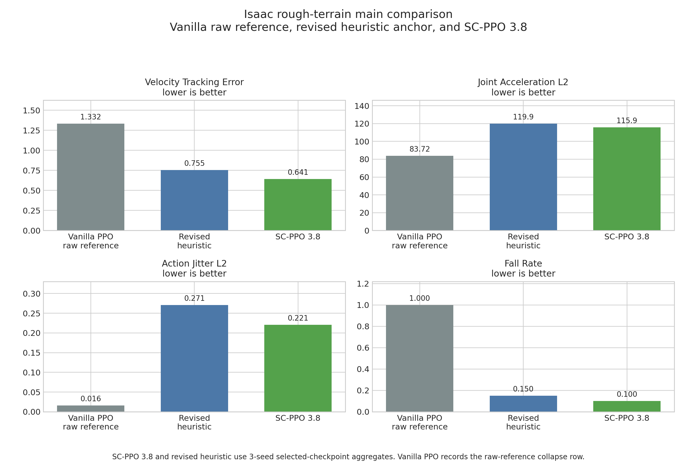
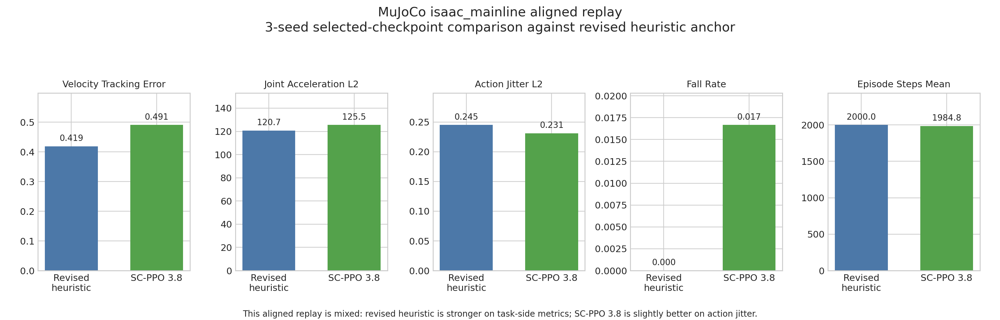
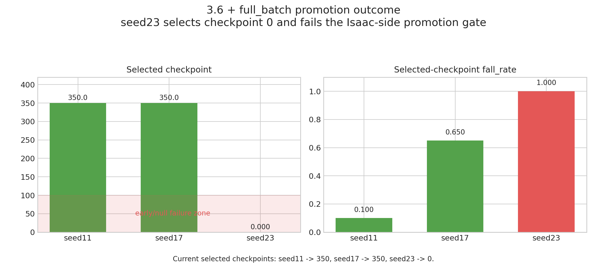

# SC-PPO `粗糙平面` 结果报告

## 摘要

本文固定仓库当前可报告的 smooth-control 结果。在 Isaac `粗糙平面` 主实验上，修复后的
PID-Lagrangian `SC-PPO` 且 `threshold = 3.8`，已经在 `3-seed + checkpoint-sweep` 协议下
形成对 revised heuristic baseline 的主结果。在 `MuJoCo isaac_mainline` 上，对齐到 revised
heuristic anchor 后的 replay 是 `混合外部验证结论`，不是 `SC-PPO` 的跨引擎胜利。更紧的
`3.6 + full_batch` 候选线因为 Isaac 升格失败，没有取代当前 `3.8` 主线。

## 1. 研究问题与当前回答

本项目当前是 `科研验证型交付`，不是框架产品化工作。当前要回答的问题是：修复后的
PID-Lagrangian `SC-PPO`，是否能在仓库定义的 `粗糙平面` 人形机器人速度跟踪任务上，
稳定优于强启发式平滑基线。

当前可成立的回答范围很窄：

1. 在 Isaac `粗糙平面` 主实验中，修复后的 `SC-PPO` 且 `threshold = 3.8` 已经形成真实的
   `方法优于启发式` 主结果。
2. 在 `MuJoCo isaac_mainline` 上，对齐 replay 只能支持 `混合外部验证结论`：revised
   heuristic 在任务侧指标上更强，`SC-PPO 3.8` 只在 action jitter 上略强。
3. 更紧的 `3.6 + full_batch` 线没有取代当前 `3.8` 主线，因为它的正式升格尝试在 Isaac 阶段失败。

## 2. 协议与证据边界

当前 canonical configs:

- 原始参照组: `configs/methods/vanilla_ppo.json`
- 启发式锚点: `configs/methods/heuristic_smoothing_action_rate_0050_formal_protocol_revision_long_budget.json`
- 正式主线: `configs/methods/sc_ppo_threshold_38_lambda_05_quantile_090_pid_lower_bound_clamp.json`
- 升格失败候选线: `configs/methods/sc_ppo_threshold_36_lambda_05_quantile_090_pid_lower_bound_clamp_full_batch.json`

证据规则必须写死：

- Isaac 主结果基于 `3-seed + checkpoint-sweep` 的 selected checkpoints，不是 final checkpoint。
- 当前 `3.8` 主线的 selected checkpoints 分别是 `seed11 -> 300`、`seed17 -> 300`、
  `seed23 -> 400`。
- `MuJoCo isaac_mainline` 结果现在已经对齐 revised heuristic anchor，两组关键方法都使用
  `3-seed` selected-checkpoint replay。
- `hfield_moderate` 和 `hfield_stress` 不进入主结果叙事。它们仍然是 repair-stage protocol
  lines，不是 report-grade headline evidence。
- 对 `hfield_moderate` 或 `hfield_stress` 的后续工作，都应归入 terrain-side protocol repair
  backlog，而不是新的算法升格 claim。

## 3. Isaac `粗糙平面` 主结果

`Vanilla PPO` 仍然有价值，因为它给出了当前共享协议下的原始未平滑参照。但真正承载主命题的，
是启发式锚点与当前 `SC-PPO 3.8` 主线之间的对比。

### 表 1. Isaac `粗糙平面` 对比结果

| Method | Evidence scope | `velocity_tracking_error_mean` | `joint_acceleration_l2_mean` | `action_jitter_l2_mean` | `episode_return_mean` | `fall_rate` |
| --- | --- | ---: | ---: | ---: | ---: | ---: |
| `Vanilla PPO` | raw reference, frozen formal compare (`ckpt 0/0/0`) | `1.3321 +/- 0.1181` | `83.7179 +/- 13.3692` | `0.0161 +/- 0.0008` | `4.0002 +/- 0.4323` | `1.0000 +/- 0.0000` |
| `PPO + heuristic smoothing (action_rate=-0.0050)` | revised heuristic anchor (`ckpt 350/300/350`) | `0.7549 +/- 0.1068` | `119.8639 +/- 2.1966` | `0.2711 +/- 0.0084` | `100.9327 +/- 11.2711` | `0.1500 +/- 0.0816` |
| `SC-PPO 3.8` | `3-seed` selected-checkpoint aggregate (`ckpt 300/300/400`) | `0.6412 +/- 0.0554` | `115.9079 +/- 6.9386` | `0.2205 +/- 0.0017` | `100.2838 +/- 2.7150` | `0.1000 +/- 0.0000` |

表注：`Vanilla PPO` 是 raw-reference collapse record。heuristic 和 `SC-PPO` 两行都是
selected-checkpoint aggregate，不是 final-checkpoint-only summary。

这里的正确解读是：

- 原始 `Vanilla PPO` 在 frozen formal compare 中完全 collapse，只作为 raw reference。
- revised heuristic baseline 已经 task-valid，因此可以作为正式启发式锚点。
- 修复后的 PID-Lagrangian `SC-PPO 3.8` 主线，在当前 Isaac 侧共享比较指标上已经整体优于
  这个强启发式锚点，并且 collapse 明显更少。

这就是当前仓库里最强的主结果。

图 1. 当前共享指标下的 Isaac 主结果图。`SC-PPO 3.8` 使用 seeds `11/17/23` 的
selected-checkpoint aggregate。

## 4. `MuJoCo isaac_mainline` Aligned Replay

当前 `MuJoCo` 结论必须弱于 Isaac 主结果。对齐到 revised heuristic anchor 后，可比范围是：

- heuristic anchor: checkpoints `350 / 300 / 350`
- `SC-PPO 3.8`: checkpoints `300 / 300 / 400`
- protocol: `terrain_mode = isaac_mainline`, `joint_reset_noise = 0.1`, `20 episodes`,
  `20 seconds`

### 表 2. `MuJoCo isaac_mainline` aligned 对比

| Method | Evidence scope | `velocity_tracking_error_mean` | `joint_acceleration_l2_mean` | `action_jitter_l2_mean` | `fall_rate` | `episode_steps_mean` |
| --- | --- | ---: | ---: | ---: | ---: | ---: |
| `PPO + heuristic smoothing (action_rate=-0.0050)` | revised anchor, `3-seed` selected-checkpoint replay | `0.4188 +/- 0.0398` | `120.7339 +/- 2.6413` | `0.2452 +/- 0.0288` | `0.0000 +/- 0.0000` | `2000.0 +/- 0.0` |
| `SC-PPO 3.8` | `3-seed` selected-checkpoint replay | `0.4910 +/- 0.0944` | `125.5411 +/- 21.1683` | `0.2313 +/- 0.0351` | `0.0167 +/- 0.0236` | `1984.8 +/- 21.5` |

这里应严格按当前证据解释：

- revised heuristic anchor 在任务稳定性、速度跟踪、episode length 和 joint acceleration 上更强。
- `SC-PPO 3.8` 只在 `action_jitter_l2_mean` 上略强。
- 这个 MuJoCo replay 没有保持 Isaac 侧的排序。

所以当前正确口径是 `混合外部验证结论`，不能写成 `SC-PPO` 的跨引擎胜利。

标题级安全表述：

`在当前 Isaac 粗糙平面主实验中，修复后的 PID-Lagrangian SC-PPO（threshold = 3.8）已经形成对 revised heuristic baseline 的主结果；但在对齐后的 MuJoCo isaac_mainline replay 中，这个排序没有迁移，因此外部验证结果应写成混合外部验证结论，而不是 SC-PPO 的跨引擎胜利。`

图 2. 对齐 revised heuristic anchor 后的 `MuJoCo isaac_mainline` replay。

## 5. 为什么当前正式主线仍然是 `3.8`

`3.6 + full_batch` 这条线的定位很窄：它只是用来挑战当前 `3.8` 主线，不是重新对 heuristic
做一轮全新的 repo-wide claim。

当前升格规则是：

- 复用 `seed11`
- 新增 `seed17` 和 `seed23`
- 每个 seed 都必须先通过 Isaac-side hard gate
- pathological early or null checkpoint selection 直接判失败

### 表 3. `3.6 + full_batch` Isaac 升格结果

| Seed | Selected checkpoint | `velocity_tracking_error_mean` | `joint_acceleration_l2_mean` | `action_jitter_l2_mean` | `fall_rate` | Reading |
| --- | ---: | ---: | ---: | ---: | ---: | --- |
| `11` | `350` | `0.5735` | `116.0164` | `0.2107` | `0.1000` | 局部很强 |
| `17` | `350` | `0.6770` | `129.7265` | `0.2289` | `0.6500` | 明显不稳, 但非空 |
| `23` | `0` | `1.2863` | `80.8770` | `0.0115` | `1.0000` | pathological null selection |

当前结论非常明确：

- `seed11` 看起来很有希望；
- `seed17` 已经明显更弱；
- `seed23` 直接选到 `checkpoint 0`，触发仓库的 early-checkpoint failure rule。

因此这条线在 Isaac 阶段就停止，不能再消费新的 `MuJoCo isaac_mainline` 预算。
`3.6 + full_batch` 应回读为已完成的 `诊断支线`，而不是新的正式主线。

PID 有限机制消融备注：

- matched `普通对偶上升` 诊断在 `threshold = 3.8`、checkpoint `100` 下完成评估。
- 该诊断在最小 Isaac 评估中 collapse：`fall_rate = 1.0000`，`episode_return_mean = 4.7101`，
  `velocity_tracking_error_mean = 1.1646`。
- 它的 `action_jitter_l2_mean = 0.1661` 更低，但因为策略不 task-valid，不能当作可用的平滑胜利。
- 这只支持继续把 `PID-Lagrangian` 作为正式 `SC-PPO` 更新方式；它是 `PID有限消融`，
  不是全组件归因研究。

图 3. 正式 `3.6 + full_batch` 升格线在 Isaac 阶段失败，核心原因是 `seed23`
选到了 `checkpoint 0`。

## 6. 当前已成立的结果与剩余边界

当前已成立：

- 修复后的 PID-Lagrangian `SC-PPO` 且 `threshold = 3.8` 是当前正式主线。
- 在 Isaac `粗糙平面` 主实验上，这条线已经支持可辩护的 `方法优于启发式` 结论。
- 这个主结果经过了 `3 seeds`，并且显式依赖 checkpoint sweep selection。
- 最近的更紧候选线 `3.6 + full_batch` 没能取代当前主线。
- `MuJoCo isaac_mainline` 已经对齐 revised heuristic anchor，但结论是 `混合外部验证结论`。
- matched `普通对偶上升` 诊断 collapse，因此 PID 有限消融只支持当前
  `PID-Lagrangian` 算法边界，不新增主线结果。

当前还不能成立：

- final checkpoint 单独就足够支撑当前 `SC-PPO` 主线
- Isaac 侧排序已经迁移到 `MuJoCo`
- 平滑性优势已经完整迁移到 `MuJoCo`
- `hfield_moderate` 或 `hfield_stress` 已经可以当作 report-grade terrain 结果
- 一整片更紧 threshold 邻域都能等价替代当前 `3.8` 主线
- PID 有限诊断已经证明每个 PID 子项都独立必要

因此后续任何 terrain-side 工作都应被理解为 external-validation semantics 上的 protocol repair，
而不是说明有另一条算法线已经准备好取代当前主线。

## 7. Canonical Artifacts

Isaac 主结果:

- `artifacts/analysis/rough_terrain_formal_comparison/comparison_summary.json`
- `artifacts/analysis/rough_terrain_formal_protocol_revision_long_budget/comparison_summary.json`
- heuristic selected metrics:
  `artifacts/methods/heuristic_smoothing_formal_protocol_revision_long_budget/*/metrics_selected.json`
- `SC-PPO 3.8` selected metrics and checkpoint sweeps:
  `artifacts/methods/sc_ppo_pid_probe/sc_ppo_threshold_38_lambda_05_quantile_090_pid_lower_bound_clamp_rough_terrain_iter400_seed*/`

`MuJoCo isaac_mainline` aligned replay:

- heuristic:
  `artifacts/methods/heuristic_smoothing_formal_protocol_revision_long_budget/*/metrics_mujoco_isaac_mainline_20ep_20s_noise01.json`
- `SC-PPO 3.8`:
  `artifacts/methods/sc_ppo_pid_probe/sc_ppo_threshold_38_lambda_05_quantile_090_pid_lower_bound_clamp_rough_terrain_iter400_seed*/metrics_mujoco_isaac_mainline_20ep_20s_noise01.json`

升格失败候选线:

- `artifacts/methods/sc_ppo_fullbatch_threshold_probe/sc_ppo_fullbatch_threshold_36_iter400_seed*/checkpoint_sweep_summary.json`

PID 有限机制诊断:

- `docs/sc-ppo-pid-limited-ablation.md`
- `artifacts/analysis/sc_ppo_pid_limited_ablation/summary.json`

生成图表:

- `scripts/analysis/generate_sc_ppo_report_figures.py`
- `artifacts/analysis/sc_ppo_report_figures/figure_isaac_main_result.png`
- `artifacts/analysis/sc_ppo_report_figures/figure_mujoco_aligned_replay.png`
- `artifacts/analysis/sc_ppo_report_figures/figure_threshold36_promotion_failure.png`
- `artifacts/analysis/sc_ppo_report_figures/manifest.json`

## 8. 主线后诊断与冻结边界

主线 `粗糙平面` 结果固定后，仓库又完成了三个有界诊断。它们用于明确交付边界，不新增标题级主结果：

- `PID有限消融` 支持继续把 `PID-Lagrangian` 作为正式 `SC-PPO` 更新方式。matched
  `普通对偶上升` probe collapse，因此这个结果只能作为机制支持，不能扩展成全组件归因。
- `SN-only` 替代机制诊断已经证明实现可运行，但结论是负向的。full-actor、hidden-layer-only、
  `coeff = 2.0` 和 first-hidden-only reduced-budget variants 全部 collapse，因此不应继续盲目
  做 SN-only 架构开关。
- `随机阶梯` selected-checkpoint stress test 作为直接迁移失败关闭。Vanilla PPO、revised
  heuristic anchor 和 `SC-PPO 3.8` 在第一版 stairs-only protocol 下全部 `fall_rate = 1.0`，
  所以它不是 task-valid 的随机阶梯方法排序。

因此仓库进入 `科研交付冻结`：当前产物是 `仓库内科研交付包`，目标是让报告、tracker、artifact
指针和复现入口一致。冻结期只做 `冻结期轻量验证`，包括 tests、JSON/path sanity、Markdown
一致性和 git hygiene。新的 moderated stairs protocol、task-stabilized SN recipe 或 terrain
repair 都应作为 post-freeze branch 单独打开，不能混入本报告。

冻结参考：

- `artifacts/analysis/final_research_delivery_freeze/summary.json`
- `docs/reproduction/final-research-delivery-checklist.md`
- `docs/adr/0001-freeze-research-delivery-before-new-protocol-repair.md`
- `docs/sc-ppo-sn-feasibility-diagnostic.md`
- `docs/random-stairs-selected-checkpoint-stress.md`
- `artifacts/analysis/sn_replacement_diagnostic/sn_ppo_first_hidden_rough_terrain_medium_seed123145_summary.json`
- `artifacts/analysis/random_stairs_selected_checkpoint_stress/comparison_summary.json`
